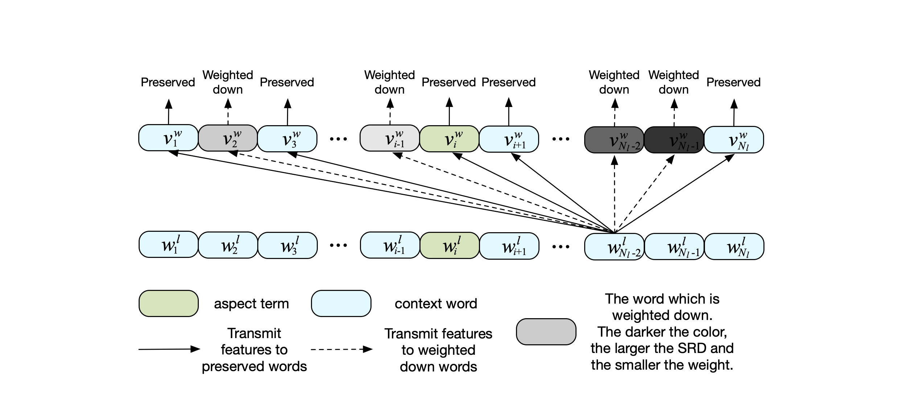
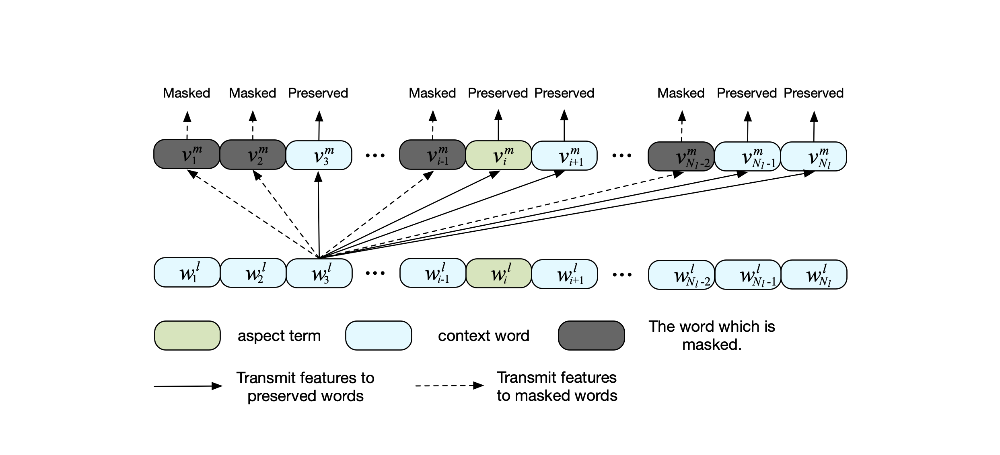

# Local Context Focus mechanism

Local Context Focus (LCF) mechanism is a simple and adoptive mechanism proposed for ABSA. Most previous works divided the input sequence into aspect term sequence and context sequence, then models their interrelation. We find that apart from the global context, the local context of aspect terms contains more significant information. Therefore, they proposed the Semantic-Relative Distance (SRD) to measure the relevance between the aspect term and its context words, aiming to assist the model to capture local context. In addition, we design a Local Context Focus (LCF) mechanism to pay more attention to the local context words whose SRD does not exceed the **predefined fixed threshold**. According to our experiments in SemEval-2014, 15, and 16, LCF works best when the predefined fixed threshold is set 3. LCF contains two patterns: Context Dynamic Weighted (CDW) and Context Dynamic Masked (CDM). More detail about LCF is available in our paper.

## LCF architecture

## The simulation of Context Dynamic Weighted (CDW)
CDW weight down the less-semantic-relative context words.

## The simulation of Context Dynamic Masked (CDM)
CDW masked the less-semantic-relative context words.

# Some works based on LCF
[1] Phan M H, Ogunbona P O. Modelling context and syntactical features for aspect-based sentiment analysis[C]//Proceedings of the 58th Annual Meeting of the Association for Computational Linguistics. 2020: 3211-3220.
[2] Hyun D, Cho J, Yu H. Building Large-Scale English and Korean Datasets for Aspect-Level Sentiment Analysis in Automotive Domain[C]//Proceedings of the 28th International Conference on Computational Linguistics. 2020: 961-966.
[3] Yang H, Zeng B, Yang J H, et al. A multi-task learning model for chinese-oriented aspect polarity classification and aspect term extraction[J]. Neurocomputing, 2021, 419: 344-356.
[4] Ke W, Gao J, Shen H, et al. Incorporating Explicit Syntactic Dependency for Aspect Level Sentiment Classification[J]. Neurocomputing, 2021.
[5] Luo W, Yi S, Chen J, et al. Does ensemble really work when facing the twitter semantic classification?[C]//2020 5th International Conference on Computational Intelligence and Applications (ICCIA). IEEE, 2020: 39-43.
[6] de Araújo A F, Marcacini R M. RE-BERT: automatic extraction of software requirements from app reviews using BERT language model[C]//Proceedings of the 36th Annual ACM Symposium on Applied Computing. 2021: 1321-1327.
[7] Das A, Zhang W E. ABSA-Bench: Towards the Unified Evaluation of Aspect-based Sentiment Analysis Research[C]//Proceedings of The 18th Annual Workshop of the Australasian Language Technology Association. 2020: 65-71.
[8] Gui T, Wang X, Zhang Q, et al. Textflint: Unified multilingual robustness evaluation toolkit for natural language processing[J]. arXiv preprint arXiv:2103.11441, 2021.
[9] Yang H, Zeng B. Enhancing Fine-grained Sentiment Classification Exploiting Local Context Embedding[J]. arXiv preprint arXiv:2010.00767, 2020.
[10] Orbach M, Toledo-Ronen O, Spector A, et al. YASO: A New Benchmark for Targeted Sentiment Analysis[J]. arXiv preprint arXiv:2012.14541, 2020.
[11] Hamborg F, Donnay K, Gipp B. Towards Target-dependent Sentiment Classification in News Articles[J]. arXiv preprint arXiv:2105.09660, 2021.
[12] Mukherjee R, Shetty S, Chattopadhyay S, et al. Reproducibility, Replicability and Beyond: Assessing Production Readiness of Aspect Based Sentiment Analysis in the Wild[J]. arXiv preprint arXiv:2101.09449, 2021.

Try to design your model on LCF!